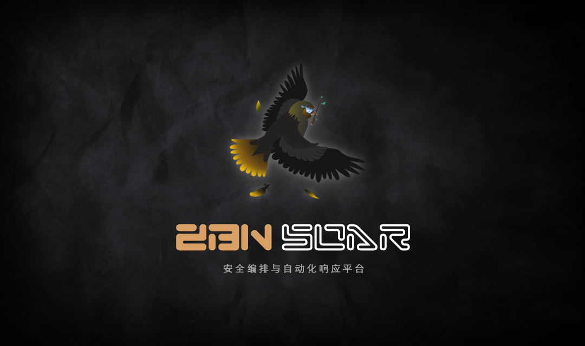
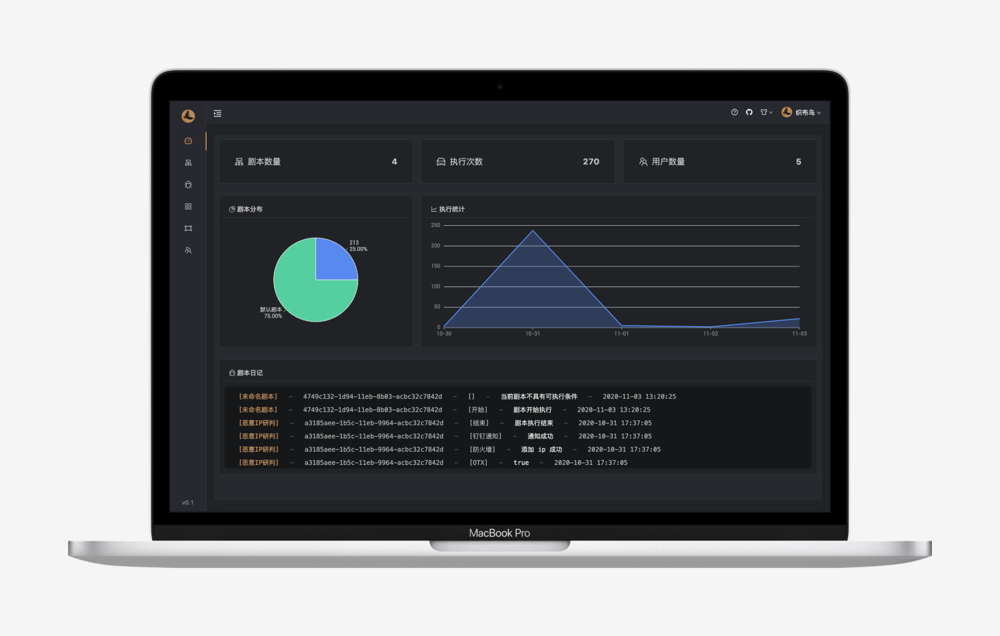
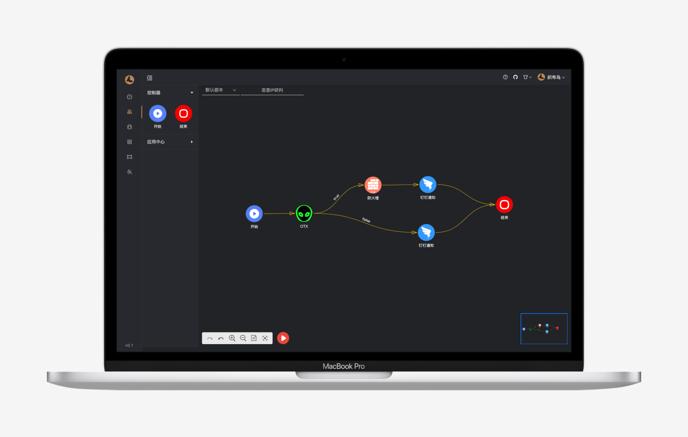

## ZBN SOAR 是什么?

**ZBN SOAR** 是一款安全编排与自动化响应平台，将安全产品以及安全流程链接整合起来，通过预定义的工作流（Workflow）和剧本（Playbook）来标准化事故的调查处置流程，提升威胁响应的自动化程度和执行效率。

## ZBN SOAR 的价值

* 缩短应急处置安全事故的时间
* 减少和优化传统SOC中不必要和冗余的工作
* 安全产品整合的API加速了自动化
* 丰富的安全数据服务：威胁情报平台TIP
* 提高告警分析的质量和侦测发现能力
* 提高工作精准度，安全运维流程的文档化以及证据的管理
* 减少培训新安全运维分析人员的代价
* 整体提高衡量和管理安全运维的能力

## ZBN SOAR 平台展示

### 仪表盘展示

### 剧本展示

## 直达连接

- 官网：https://zbn.io
- Github：https://github.com/zbnio/zbn
- 文档： https://www.yuque.com/zbn/docs/ayilv9

## 联系作者

### E-Mail

- lauixData@gmail.com

### 微信

> 加作者微信进群，请备注 **SOAR**、**ZBN**、**织布鸟**  

